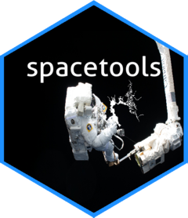

<!-- README.md is generated from README.Rmd. Please edit that file -->

```{r, include = FALSE}
knitr::opts_chunk$set(
  collapse = TRUE,
  comment = "#>",
  fig.path = "man/figures/README-",
  out.width = "100%"
)
```

# spacetools 

<!-- badges: start -->
[](https://github.com/sbashevkin/spacetools/actions)
[](https://codecov.io/gh/sbashevkin/spacetools?branch=master)
<!-- badges: end -->

The goal of spacetools is to provide easy tools for spatial operations. Functionality is focused on aquatic systems and particularly the Sacramento San Joaquin Delta but the functions should be useful for other systems as well. 

## Installation

You can install the development version from [GitHub](https://github.com/) with:

``` r
# install.packages("devtools")
devtools::install_github("sbashevkin/spacetools")
```

## Code of Conduct
Please note that the 'spacetools' project is released with a [Contributor Code of Conduct](CODE_OF_CONDUCT.md). By contributing to this project, you agree to abide by its terms.
